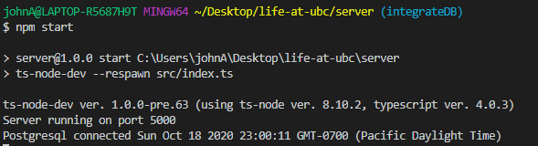

# Life @ UBC


### Installation (if you don't have these already)
- Node from https://nodejs.org/en/
- Git https://git-scm.com/downloads
- VS Code (Optional - but highly recommended) https://code.visualstudio.com/

### Setup Without Docker
#### Client
- `cd client`
- `npm install` to install all dependencies 
- `npm start` to build & start the React app

#### Server
- `cd server`
- `npm install` in the root directory to install all dependencies
- `npm start` to start the Node.js server

#### Database
- Install PostgreSQL 12.4 (untick pgAdmin installation, we'll install this separately) https://www.enterprisedb.com/downloads/postgres-postgresql-downloads
- pgAdmin version 4.27 release https://www.pgadmin.org/download/
- open `pgAdmin` -> `PostgreSQL 12` -> `Databases`
- Right click `Databases` and `Create` -> `Database`
- name:`'postgres'`, owner: `'postgres'`, password: `123456` (This is the current hard coded config defined in server file)
- If setup correctly you should see the following when running npm start in server:



### Setup With Docker Compose

#### Server
- Make sure that you have `.env` file on the root directory of server (ask one of us!). This file defines `DB_DATABASE`, `DB_PASSWORD`, `DB_USER`, and `DB_HOST`
- `npm install` in the root directory of server to install all dependencies
- run `docker-compose up`
- The output of `docker-compose up` should look similar to:
```bash
$ docker-compose up
Starting db ... done
Recreating server ... done
Attaching to db, server
db        |
db        | PostgreSQL Database directory appears to contain a database; Skipping initialization
db        |
db        | 2020-10-21 05:08:47.377 UTC [1] LOG:  starting PostgreSQL 13.0 on x86_64-pc-linux-musl, compiled by gcc (Alpine 9.3.0) 9.3.0, 64-bit
db        | 2020-10-21 05:08:47.377 UTC [1] LOG:  listening on IPv4 address "0.0.0.0", port 5432
db        | 2020-10-21 05:08:47.378 UTC [1] LOG:  listening on IPv6 address "::", port 5432
db        | 2020-10-21 05:08:47.388 UTC [1] LOG:  listening on Unix socket "/var/run/postgresql/.s.PGSQL.5432"
db        | 2020-10-21 05:08:47.394 UTC [20] LOG:  database system was shut down at 2020-10-21 05:02:17 UTC
db        | 2020-10-21 05:08:47.401 UTC [1] LOG:  database system is ready to accept connections
server    |
server    | > server@1.0.0 start /app
server    | > ts-node-dev --respawn src/index.ts
server    |
server    | [INFO] 05:08:49 ts-node-dev ver. 1.0.0 (using ts-node ver. 8.10.2, typescript ver. 4.0.3)
server    | Server running on port 5000
server    | Postgresql connected Wed Oct 21 2020 05:08:53 GMT+0000 (Coordinated Universal Time)
```
- `docker-compose up` builds, (re)creates, starts, and attaches to containers for a service
- `docker-compose build --no-cache` does not use cache when building the image
- `docker-compose ps` lists containers
- `docker-compose rm` removes stopped service containers
- Useful resources:
    - [Docker Compose](https://docs.docker.com/compose/)
    - [Why use alpine packages?](https://nickjanetakis.com/blog/the-3-biggest-wins-when-using-alpine-as-a-base-docker-image)
    - [Postgresql documentation](https://www.notion.so/Docker-Compose-07fabb20ed224a37b9eeb83dd18dfabc#f22154ebf6e245ca88ce650d706785b5)

### Docker Installation For Windows
- WSL2 install Windows 10 https://docs.microsoft.com/en-us/windows/wsl/install-win10
- Docker Windows https://docs.docker.com/docker-for-windows/wsl/ - there’s a tidbit here on using VSCode’s Remote-WSL extension that easily allows you to work with a remote server in the Linux distro and your IDE client still on Windows

